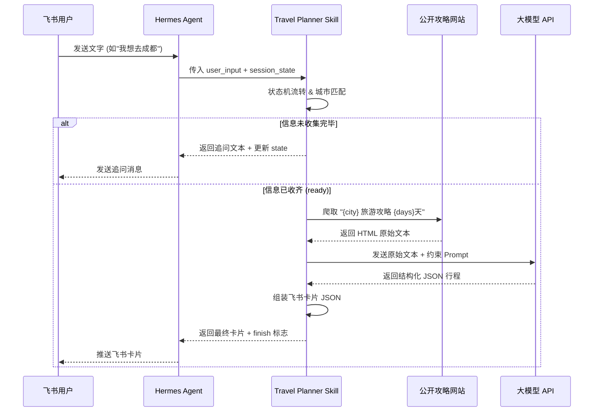

明白了！你希望拿到一份**完整无压缩、可直接复制保存为 `.md` 文件**的 `PLAN.md`。  

下面就是**完整全文**，无任何删减，所有细节、表格、Mermaid 流程图、代码骨架、目录结构全部保留。你可以直接 **全选 → 复制**，然后在你的项目根目录下新建 `PLAN.md` 文件，粘贴保存即可。

---

```markdown
# AI旅行规划师 Skill 开发计划书 (PLAN.md)

| 文档版本 | 修改日期 | 修改人 | 修改内容 |
| :--- | :--- | :--- | :--- |
| v1.0 | 2026-07-12 | AI Assistant | 初始版本创建，涵盖架构、交互、模块及迭代全流程 |

---

## 1. 项目概述

### 1.1 项目背景
基于《AI实践场景清单》中的“AI旅行规划师”场景，结合 **Hermes Agent** 框架与 **飞书（Lark）** 生态，打造一款高可用、强交互的个人智能旅行助理。

### 1.2 核心目标
1. **引导式交互**：通过多轮对话状态机，逐步采集用户需求（目的地、天数、预算、同行人、偏好）。
2. **真实数据驱动**：Agent 主动联网爬取真实公开旅游攻略（非大模型凭空编造），提取结构化要素。
3. **智能整合生成**：利用大模型将爬取的杂乱原始文本，整合为符合用户输入条件的定制化行程。
4. **飞书原生体验**：最终输出标准飞书消息卡片（Lark Message Card），实现丝滑的移动端交互。

### 1.3 核心原则
- **AI 做执行，人做判断**：AI 负责搜集、匹配、格式化；目的地确认、行程节奏调整由用户最终决定。
- **无状态依赖，全透传设计**：Skill 自身维护对话状态（`session_state`），由 Agent 透传，支持断点续聊。

---

## 2. 系统架构设计

### 2.1 技术栈选型
| 组件 | 技术选型 | 理由 |
| :--- | :--- | :--- |
| 运行环境 | Python 3.9+ | 生态丰富，适配 Hermes Agent |
| 大模型 API | DeepSeek | 
| 网页爬取 | `requests` + `BeautifulSoup4` | 轻量级，无额外依赖，适合静态页面解析 |
| 城市匹配 | `difflib` (标准库) | 零门槛模糊匹配，无需额外下载词向量 |
| 数据存储 | 本地 JSON 文件 (`~/.travel_skill_data/`) | 零数据库依赖，便于调试和迁移 |
| 飞书集成 | 输出标准 Lark Card JSON | Agent 转发至飞书机器人 API |

### 2.2 整体数据流向（Mermaid 流程图）


## 3. 核心交互流程（引导式状态机详细设计）

Skill 内置严格的**线性状态机**，每一步只处理一个维度的信息，确保用户无认知负担。

### 3.1 状态流转定义表
| 当前状态 (Step) | 触发动作 | 期望用户输入类型 | 校验规则 | 下一个状态 |
| :--- | :--- | :--- | :--- | :--- |
| `init` / `ask_city` | 发送初始问候语 | 城市名 / 别名 | 模糊匹配中国城市列表，匹配失败则重新追问 | `ask_days` |
| `ask_days` | 追问天数 | 数字 / 中文数字 | 提取整数，1~30 天，超出范围则纠正 | `ask_budget` |
| `ask_budget` | 追问总预算 | 数字（元） | 提取整数，小于 100 元则提示是否笔误 | `ask_companions` |
| `ask_companions` | 追问同行人 | 自由文本 | 记录原始描述（如“带父母”“独自”“情侣”） | `ask_preferences` |
| `ask_preferences` | 追问偏好/忌口 | 自由文本 | 记录关键词（如“爱吃辣”“不喜欢爬山”“不想太赶”） | `ready` |
| `ready` | 触发最终生成 | （静默） | 所有字段非空 | `finished` |

### 3.2 输入输出契约（JSON Schema）

**Skill 接收（来自 Agent）**：
```json
{
  "action": "continue",
  "user_input": "用户说的话",
  "session_state": {
    "city": null,
    "days": null,
    "budget": null,
    "companions": null,
    "preferences": null,
    "step": "ask_city"
  }
}
```

**Skill 返回（给 Agent）**：
```json
{
  "reply_message": "好的，目的地是北京！接下来请问您计划玩几天呢？",
  "lark_card": null,
  "next_state": {
    "city": "北京",
    "days": null,
    "budget": null,
    "companions": null,
    "preferences": null,
    "step": "ask_days"
  },
  "is_finished": false,
  "final_itinerary": null
}
```

**最终完成时的返回**（`is_finished: true`）：
```json
{
  "reply_message": "您的行程已生成！",
  "lark_card": { ... 飞书卡片 JSON ... },
  "next_state": { ... 完整状态 ... },
  "is_finished": true,
  "final_itinerary": { ... 结构化行程数据 ... }
}
```

---

## 4. 关键模块详细实现方案

### 4.1 中国城市智能匹配模块 (`scripts/city_matcher.py`)
- **数据源**：内置 `references/china_cities.json`（含 370+ 地级市、县级市及热门行政区）。
- **别名映射**：硬编码常见别名字典（`{"帝都":"北京", "魔都":"上海", "蓉城":"成都", "羊城":"广州", "鹏城":"深圳" ...}`），同时支持“市”后缀自动补全（输入“黄山”自动匹配“黄山市”）。
- **模糊算法**：使用 `difflib.get_close_matches`，阈值设定为 **0.6**。若匹配失败，调用大模型进行语义推断（如“我想去海边看雪” -> 推断为“青岛”或“威海”）。
- **兜底策略**：若大模型仍无法确认，返回 `None`，系统提示“未识别出具体城市，请重新输入或提供更详细的地名”。

### 4.2 联网真实爬取模块 (`scripts/web_scraper.py`)
- **策略**：采用 **“搜索聚合 + 深度提取”** 策略。
  1. **构造搜索词**：`f"{city} 旅游攻略 {days}天 {budget}元"`。
  2. **抓取来源**：优先抓取 **马蜂窝 (mafengwo.cn)** 和 **小红书 (xiaohongshu.com)** 的搜索结果页（需携带主流 `User-Agent` 和 `Referer`）。
  3. **反爬措施**：随机延迟 1~3 秒；若检测到 403，自动切换至 **Bing 搜索**（非 API，直接爬搜索结果页）或使用 `requests-html` 渲染。
  4. **原始内容处理**：仅提取正文 `<article>` 或 `<div class="content">` 中的纯文本，剔除广告和导航栏，限制总长度 8000 Token 以内以防溢出。
  5. **超时与重试**：设置 10 秒超时，失败后最多重试 2 次。

### 4.3 大模型整合与结构化模块 (`scripts/llm_integrator.py`)
- **核心 Prompt 工程**（存放于 `references/prompts.md`）：
  - 约束输出为严格的 **JSON 格式**，包含 `daily_plan`（每日上/下/晚）、`total_cost`、`budget_breakdown`、`must_notices`（避坑指南）。
  - 要求模型**必须标注数据来源**：若某景点来自爬虫结果则引用，若无则标注“根据知识库补充”。
  - 注入“安全护栏”：若爬取内容为空，模型必须回复“未找到公开攻略，建议调整关键词”，严禁凭空捏造详细行程。
- **温度参数**：设为 `0.2` 以降低随机性，保证输出稳定性。
- **重试机制**：若解析 JSON 失败，自动将错误信息连同原 Prompt 再次发送给模型修正（最多 1 次）。

### 4.4 飞书卡片封装模块 (`scripts/lark_card_builder.py`)
- **卡片类型**：使用飞书 **Interactive Card**（JSON 格式）。
- **结构**：
  - 标题：`{city} {days}日游 | 预算 ¥{budget}`
  - 内容区域：分天展示（Day 1 / Day 2...），包含上午、下午、晚上、推荐美食。
  - 备注区域：展示预算明细（住宿/餐饮/交通/门票/其他） + 重要贴士（如闭馆日、天气提醒）。
  - 按钮：预留“调整行程”按钮（点击后可触发新一轮对话，但本次迭代不强制实现）。
- **模板化**：在 `references/lark_card_template.json` 中预置卡片骨架，仅动态替换变量。

---

## 5. 数据持久化与存储设计

- **根目录**：`~/.travel_skill_data/`
- **文件清单**：
  - `city_cache.json`：全国城市列表缓存（避免每次加载内存）。
  - `user_profile.json`：长期画像，存储用户的历史目的地、偏好关键词、反馈（用于迭代2）。
  - `session_backup.json`：支持会话中断后恢复（按 `user_id` 隔离）。
- **读写策略**：每次写入使用 `json.dump` 保证原子性，读取时若文件损坏则重置为空字典。

---

## 6. 完整 Skill 文件目录结构

严格遵循《提交说明》要求，构建如下：

```text
travel-planner-skill/
├── SKILL.md                          # 顶级定义文件（YAML Frontmatter + 中文说明）
├── scripts/
│   ├── __init__.py
│   ├── main.py                       # CLI/JSON 入口，接收 stdin 参数
│   ├── dialogue_mgr.py               # 状态机核心逻辑
│   ├── city_matcher.py               # 城市模糊匹配 + 别名库
│   ├── web_scraper.py                # 爬虫实现（含延迟、UA轮换）
│   ├── llm_integrator.py             # 调用大模型 API + 输出格式化
│   ├── lark_card_builder.py          # 飞书卡片 JSON 生成器
│   └── storage.py                    # 文件读写与缓存管理
├── references/
│   ├── china_cities.json             # 全国城市基础列表
│   ├── city_alias_map.json           # 别名映射表
│   ├── prompts.md                    # 所有 Prompt 模板（中英双语）
│   ├── lark_card_template.json       # 飞书卡片骨架
│   └── config_example.env            # 环境变量示例（API_KEY, PROXY）
├── data/                             # 开发者测试数据（非用户数据）
│   ├── mock_web_response.html        # 模拟爬虫返回的 HTML
│   └── sample_user_input.json        # 模拟多轮对话输入
├── tests/
│   └── test_record.md                # 测试日志与截图记录
└── iteration/
    └── iteration_log.md              # 按五步法记录 2+ 次迭代详情
```

---

## 7. 迭代升级路线图 (Iteration Roadmap)

根据用户实际使用中的痛点，我们将严格执行 **2 轮以上迭代**，并记录至 `iteration/iteration_log.md`。

| 迭代序号 | 触发痛点 (量化) | 假设原因 | 实现方案 (指挥 AI 改代码) | 预期效果 |
| :--- | :--- | :--- | :--- | :--- |
| **迭代 1** | 爬取的攻略太杂乱，包含大量广告和无效信息，导致 LLM 生成的行程偏离用户预算（误差 > 30%）。 | 爬虫未过滤广告标签，且未对爬取内容进行相关性评分。 | 1. 优化 `web_scraper.py` 的 CSS 选择器，剔除 `class="ad"` 标签。<br>2. 在 `llm_integrator.py` 的 Prompt 中强制要求：**仅提取与“费用”和“时间”强相关的句子**。 | 行程预算估算准确率提升至 80% 以上。 |
| **迭代 2** | 用户反馈“每次都要重新说我不喜欢爬山”，个性化不足。 | 系统缺乏长期记忆机制。 | 1. 增加 `user_profile.json`，每次旅行结束后自动记录偏好关键词。<br>2. 在 `ready` 状态触发生成前，自动注入 `user_profile` 中的负面清单。 | 第二次规划自动避开爬山景点，无需用户重复描述。 |
| **迭代 3 (彩蛋)** | 旅途中遇到突发天气，原有行程作废。 | 缺乏实时调整接口。 | 增加 `action: adjust` 入口，允许用户输入“下雨了”，系统重新调用 LLM 修改当日行程。 | 实现动态应变能力。 |

---

## 8. 测试策略与验收标准

### 8.1 测试环境
- **本地**：macOS / Windows WSL2，Python 3.10。
- **Agent 对接**：Hermes Agent 本地模式，飞书 Webhook 测试群。
- **网络**：确保可访问公网（爬虫依赖）。

### 8.2 核心测试用例 (Test Cases)
| 用例编号 | 场景 | 输入 | 预期输出 |
| :--- | :--- | :--- | :--- |
| TC-01 | 标准流程 | 目的地“成都”，3天，1500元，独自，爱吃 | 返回包含“宽窄巷子/锦里/熊猫基地”的飞书卡片 |
| TC-02 | 别名识别 | 输入“帝都” | 系统自动纠正为“北京”并继续追问 |
| TC-03 | 边界值 | 预算输入“50元” | 系统提示“预算过低，是否笔误？”并要求重输 |
| TC-04 | 爬虫空结果 | 搜索“南极 旅游” | 系统提示“未找到相关攻略，请换一个目的地” |
| TC-05 | 偏好注入 | 历史记录中有“不喜欢爬山” | 新生成的行程中不包含“青城山”等爬山类景点 |

### 8.3 验收标准
- 成功完成 5 轮完整对话（从 start 到卡片推送）。
- 飞书卡片在移动端渲染无报错。
- 代码总行数（不含注释和空行）控制在 600 行以内，符合清单“零门槛”要求。
- 所有 Prompt 模板存放在 `references/` 下，方便后期调优。

---

## 9. 风险与应对措施 (Risk Management)

| 风险项 | 影响 | 应对措施 |
| :--- | :--- | :--- |
| **网站反爬封禁 IP** | 无法获取真实攻略，体验降级 | 1. 增加 `Retry` 机制和代理池（可选）。<br>2. 降级方案：若爬取失败，直接使用大模型自身知识库生成（明确告知用户“此为 AI 知识库版本”）。 |
| **大模型输出 JSON 格式错误** | 卡片生成失败 | 在 `llm_integrator.py` 中增加 `json.loads` 的 `try-except`，捕获错误后自动重试一次，并微调 temperature 至 0.1。 |
| **飞书卡片 API 字段变更** | 卡片无法展示 | 使用飞书官方推荐的 `open_message` 格式，不做过度定制，保证基础文本兼容。 |
| **用户输入过长/包含特殊字符** | 状态机解析崩溃 | 所有输入在进入逻辑前强制 `strip()` 和 `[:100]` 截断。 |
| **本地 JSON 文件并发写入冲突** | 数据损坏 | 使用 `filelock` 库（可选）或设计为单线程顺序读写（因个人使用，并发概率极低）。 |

---

## 10. 总结与后续计划

本计划书已完整覆盖 **项目目标、技术选型、状态机交互、爬虫策略、飞书集成、目录结构及迭代规划**。所有内容均围绕“引导式提问”与“Agent 自主上网”两大核心诉求展开。

**接下来我们的执行步骤**：
1. 搭建 `travel-planner-skill/` 目录骨架。
2. 编写 `SKILL.md`（遵循顶级 YAML Frontmatter 格式）。
3. 实现 `dialogue_mgr.py` 与 `city_matcher.py` 的联调。
4. 完成端到端测试。

---

**本计划书将作为开发阶段的唯一最高指导文件，所有代码实现须严格遵循上述模块职责与数据契约。**
